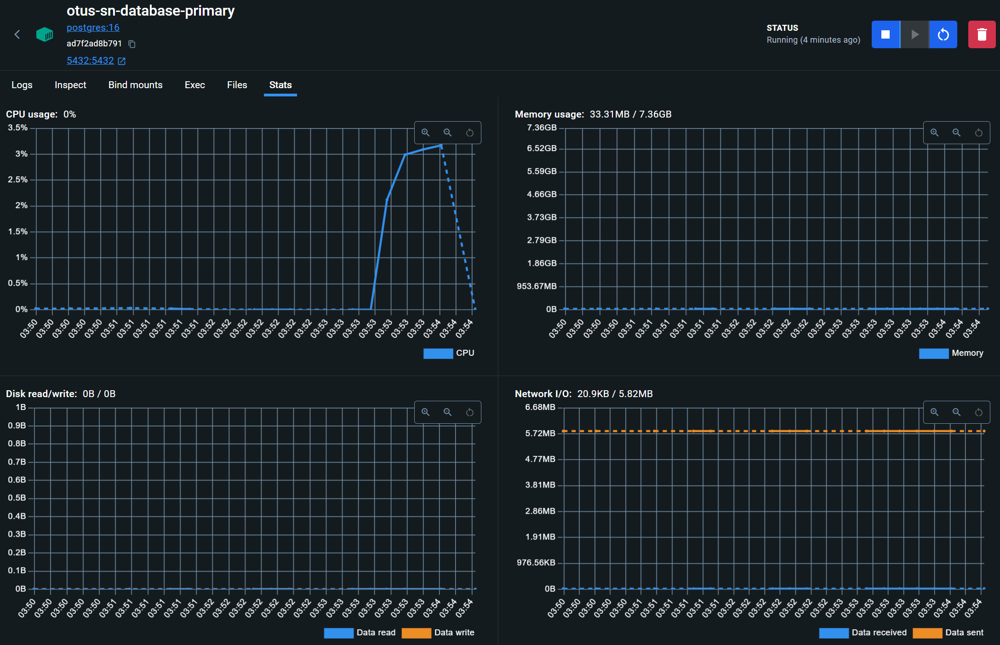
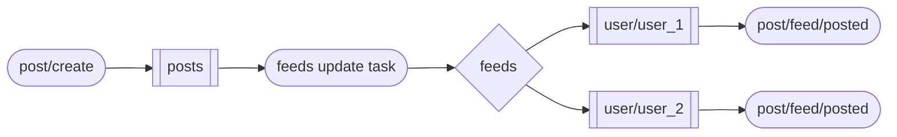

# OTUS-Social-Network

Запустить проект можно, используя команду `docker compose up` в корне проекта.

Для тестов можно использовать postman коллекцию `Otus Social Network` из корня проекта.

## ДЗ: Индексы и оптимизация запросов

В данной домашней работе требовалось проверить и улучшить производительность эндпоинта поиска пользователя по имени и фамилии.

Тестовые данные генерировались с использованием библиотеки mimesis ([скрипт](backend/scripts/gen_1kk_random_users.py)).

Нагрузочное тестирование производилось при помощи JMeter ([конфигурация](jmeter/user_search.jmx)) в 1/10/100 потоков в течение 60 секунд для каждого числа потоков.

Далее представлены графики latency и throughput до и после добавления индекса (кликабельные).

Метрика|До индексов|После индексов
-|-|-
Active Threads Over Time||
Response Times Over Time||
Transactions per Second||

Из графиков видно, что удалось улучшить latency и throughput на порядок.

Запрос на создание индексов:
```sql
CREATE INDEX users_lower_first_name_collate_c_idx ON users(lower(first_name) COLLATE "C");
CREATE INDEX users_lower_second_name_collate_c_idx ON users(lower(second_name) COLLATE "C");
```

Explain запроса на поиск после создания индексов:
```sql
Limit  (cost=241.30..241.36 rows=25 width=1279) (actual time=1.481..1.484 rows=22 loops=1)
  ->  Sort  (cost=241.30..241.36 rows=25 width=1279) (actual time=1.481..1.482 rows=22 loops=1)
        Sort Key: id
        Sort Method: quicksort  Memory: 64kB
        ->  Bitmap Heap Scan on users  (cost=141.11..240.72 rows=25 width=1279) (actual time=1.321..1.461 rows=22 loops=1)
              Filter: ((lower(first_name) ~~ 'ана%'::text) AND (lower(second_name) ~~ 'бор%'::text))
              Heap Blocks: exact=22
              ->  BitmapAnd  (cost=141.11..141.11 rows=25 width=0) (actual time=1.205..1.205 rows=0 loops=1)
                    ->  Bitmap Index Scan on users_lower_second_name_collate_c_idx  (cost=0.00..70.42 rows=5000 width=0) (actual time=0.553..0.553 rows=4268 loops=1)
                          Index Cond: ((lower(second_name) >= 'бор'::text) AND (lower(second_name) < 'бос'::text))
                    ->  Bitmap Index Scan on users_lower_first_name_collate_c_idx  (cost=0.00..70.42 rows=5000 width=0) (actual time=0.508..0.508 rows=5598 loops=1)
                          Index Cond: ((lower(first_name) >= 'ана'::text) AND (lower(first_name) < 'анб'::text))
Planning Time: 0.533 ms
Execution Time: 1.540 ms
```

Мною были выбраны именно BTree индексы, так как они позволяют быстро искать по префиксу строки.

## ДЗ: Репликация: практическое применение

1. Асинхронную репликацию настроил в docker compose следующим образом:

```yaml
version: '3'

x-postgres-common: &postgres-common
  image: postgres:16
  restart: always
  user: postgres
  healthcheck:
    test: ["CMD-SHELL", "pg_isready -U otus-sn"]
    interval: 5s
    timeout: 5s
    retries: 5

services:
  # ... other services

  otus-sn-database-primary:
    container_name: otus-sn-database-primary
    <<: *postgres-common
    ports: 
      - 5432:5432
    command: |
      postgres
      -c max_connections=200
      -c wal_level=replica 
      -c hot_standby=on 
      -c max_wal_senders=10 
      -c max_replication_slots=10 
      -c hot_standby_feedback=on
    environment: 
      POSTGRES_DB: otus-sn
      POSTGRES_USER: otus-sn
      POSTGRES_PASSWORD: otus-sn
      POSTGRES_HOST_AUTH_METHOD: "scram-sha-256\nhost replication all 0.0.0.0/0 md5"
      POSTGRES_INITDB_ARGS: "--auth-host=scram-sha-256"
    volumes: 
      - otus-sn-database-primary-data:/var/lib/postgresql/data

  otus-sn-database-replica:
    container_name: otus-sn-database-replica
    <<: *postgres-common
    ports: 
      - 5433:5432
    environment:
      PGUSER: replicator
      PGPASSWORD: replicator_password
    command: |
      bash -c '
      if [ -z "$(ls -A /var/lib/postgresql/data)" ]
      then
        until pg_basebackup --pgdata=/var/lib/postgresql/data -v -R --slot=replication_slot --host=otus-sn-database-primary --port=5432
        do
          echo "Waiting for primary to connect..."
          sleep 1s
        done
        echo "Backup done, starting replica..."
        chmod 0700 /var/lib/postgresql/data
      fi
      postgres -c max_connections=200
      '
    depends_on:
      otus-sn-database-primary:
        condition: service_healthy
    volumes: 
      - otus-sn-database-replica-data:/var/lib/postgresql/data


volumes:
  otus-sn-database-primary-data:
  otus-sn-database-replica-data:
```

2. Перенес запросы /user/get и /user/search на чтение из реплики.
3. Произвел нагрузочное тестирование этих запросов при помощи JMeter ([скрипт](jmeter/hw3_read_only.jmx)).
   - Метрики мастера во время теста: 
   - Метрики реплики во время теста: 
   Видно, что всю нагрузку приняла на себя реплика.

4. Добавил еще одну реплику:

```yaml
# ... other services
  otus-sn-database-another-replica:
    container_name: otus-sn-database-another-replica
    <<: *postgres-common
    ports: 
      - 5434:5432
    environment:
      PGUSER: replicator
      PGPASSWORD: replicator_password
    command: |
      bash -c '
      if [ -z "$(ls -A /var/lib/postgresql/data)" ]
      then
        until pg_basebackup --pgdata=/var/lib/postgresql/data -v -R --slot=another_replication_slot --host=otus-sn-database-primary --port=5432
        do
          echo "Waiting for primary to connect..."
          sleep 1s
        done
        echo "Backup done, starting replica..."
        chmod 0700 /var/lib/postgresql/data
      fi
      postgres -c max_connections=200\
        -c primary_conninfo="host=otus-sn-database-primary port=5432 user=replicator password=replicator_password application_name=anotherpgslave"
      '
    depends_on:
      otus-sn-database-primary:
        condition: service_healthy
    volumes: 
      - otus-sn-database-another-replica-data:/var/lib/postgresql/data
```

5. Настроил синхронную репликацию на мастере:

```sql
--  -c synchronous_commit=on
--  -c synchronous_standby_names='ANY 1 (pgslave, anotherpgslave)'

select application_name, state, sync_state from pg_stat_replication;

|application_name|state    |sync_state|
|----------------|---------|----------|
|pgslave         |streaming|quorum    |
|anotherpgslave  |streaming|quorum    |
```

6. Создал постоянную нагрузку на запись при помощи [скрипта](backend/scripts/gen_random_user_in_loop.py) и стопнул реплику.

7. Имеем следующую картину на мастере и оставшейся реплике:

```sql
-- otus-sn-database-primary
select count(*) from users;
 2924

-- otus-sn-database-another-replica
select count(*) from users;
 2924

-- Ни одна транзакция не "потерялась"
```

## ДЗ: Лента постов от друзей

Мною были реализованы следующие новые эндпоинты:
 - [/friend/set](backend/backend/handlers/friend_set.py) - добавляет пользователю нового друга и инвалидирует его ленту постов
 - [/friend/delete](backend/backend/handlers/friend_delete.py) - удаляет у пользователя друга и инвалидирует его ленту постов
 - [/post/create](backend/backend/handlers/post_create.py) - добавляет новый пост в БД и очередь постов
 - [/post/get](backend/backend/handlers/post_get.py) - возвращает пост по его id
 - [/post/feed](backend/backend/handlers/post_feed.py) - возвращает закэшированную ленту для пользователя
 - [/debug/cache](backend/backend/handlers/debug_cache.py) - возвращает внутреннее состояние кэша

Помимо инвалидации в ручках изменения, кэш еще [прогревается](backend/backend/__init__.py) при старте приложения.

В качестве кэша использовался обычный питоновский словарь. Кажется, что этого достаточно для учебных целей. В дальнейшем его можно будет легко заменить например на Redis. 


## ДЗ: Онлайн обновление ленты новостей

Мною были изменен эндпоинт [/post/create](backend/backend/handlers/post_create.py). Теперь в нем, помимо сохранения поста в БД, происходит его отправка в очередь постов для дальнейшей обработки.

Также был добавлен вэбсокет-эндпоинт [/post/feed/posted](backend/backend/handlers/post_feed_posted.py). В нем в реальном времени вычитываются посты друзей пользователя из подходящей очереди.

Для корректной маршрутизации сообщений между очередями была реализована фоновая таска [feeds_update_background_task](backend/backend/background/feeds.py). Она берет пост из очереди постов, определяет всех пользователей, которые добавили автора поста в друзья, обновляет их ленты постов и пересылает посты в их персональные очереди.

Схема передачи сообщений выглядит следующим образом:


